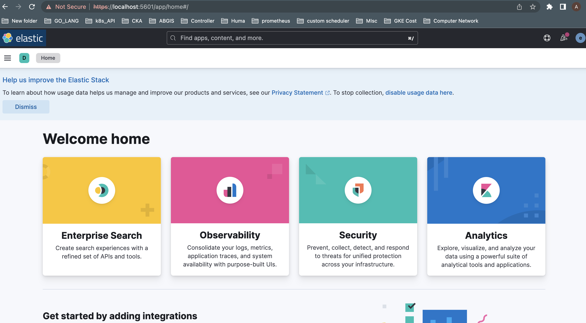
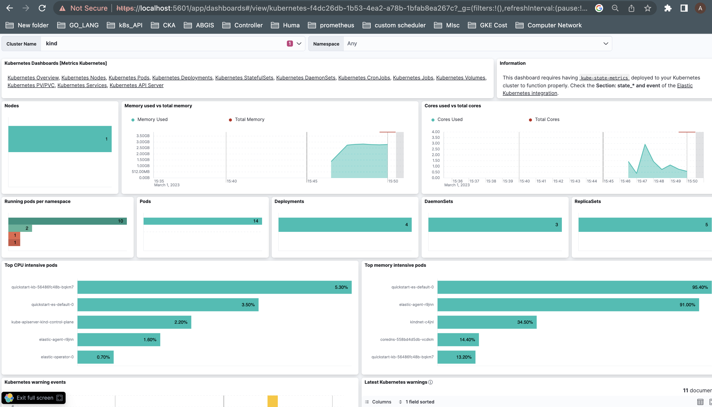

## Elasticsearch on Kubernetes

### Pre-Requisite

- Kubernetes Cluster Up and Running

### Steps

1. Deploy elastic operator
```text
kubectl create -f https://download.elastic.co/downloads/eck/2.6.1/crds.yaml
```
Following resources would be created

```text
customresourcedefinition.apiextensions.k8s.io/agents.agent.k8s.elastic.co created
customresourcedefinition.apiextensions.k8s.io/apmservers.apm.k8s.elastic.co created
customresourcedefinition.apiextensions.k8s.io/beats.beat.k8s.elastic.co created
customresourcedefinition.apiextensions.k8s.io/elasticmapsservers.maps.k8s.elastic.co created
customresourcedefinition.apiextensions.k8s.io/elasticsearches.elasticsearch.k8s.elastic.co created
customresourcedefinition.apiextensions.k8s.io/enterprisesearches.enterprisesearch.k8s.elastic.co created
customresourcedefinition.apiextensions.k8s.io/kibanas.kibana.k8s.elastic.co created
```

Install the operator with its RBAC rules:

```text
kubectl apply -f https://download.elastic.co/downloads/eck/2.6.1/operator.yaml
```

Check the operator in elastic-system namespace
```text
#kubectl get pods  -n elastic-system
NAME                 READY   STATUS    RESTARTS   AGE
elastic-operator-0   1/1     Running   0          26s
```

2. Deploy an elasticsearch cluster

- Use following command to create the elastic cluster

```text
cat <<EOF | kubectl apply -f -
apiVersion: elasticsearch.k8s.elastic.co/v1
kind: Elasticsearch
metadata:
  name: quickstart
spec:
  version: 8.6.2
  nodeSets:
  - name: default
    count: 1
    config:
      node.store.allow_mmap: false
EOF
```

- If your nodes size is below 2Gi, the pods would be in pending state.
- You can use below elastic definition to create the elastic cluster.

```text
apiVersion: elasticsearch.k8s.elastic.co/v1
kind: Elasticsearch
metadata:
  name: quickstart
spec:
  version: 8.6.2
  nodeSets:
  - name: default
    count: 1
    podTemplate:
      spec:
        containers:
        - name: elasticsearch
          resources:
            requests:
              memory: 1Gi
              cpu: 2
            limits:
              memory: 1Gi
```

- Verify elastic cluster state

```text
(⎈|kind-kind:default)➜  ~ kubectl get elasticsearch
NAME         HEALTH   NODES   VERSION   PHASE   AGE
quickstart   green    1       8.6.2     Ready   104s
(⎈|kind-kind:default)➜  ~ 
```

- Check the pod

```text
⎈kubectl get pods
NAME                      READY   STATUS    RESTARTS   AGE
quickstart-es-default-0   1/1     Running   0          94s
```

- A default user named elastic is automatically created 
with the password stored in a Kubernetes secret.

```text
PASSWORD=$(kubectl get secret quickstart-es-elastic-user -o go-template='{{.data.elastic | base64decode}}')
```

- From your local workstation, use the following command in a separate terminal to access
elasticsearch endpoint.

```text
kubectl port-forward service/quickstart-es-http 9200
```

- Then Request localhost:

```text
curl -u "elastic:$PASSWORD" -k "https://localhost:9200"
```

- You will see below output if everything is right

```text
 ~ curl -u "elastic:$PASSWORD" -k "https://localhost:9200"
{
  "name" : "quickstart-es-default-0",
  "cluster_name" : "quickstart",
  "cluster_uuid" : "XAZ1BC44RiGFeh4ok_C9tg",
  "version" : {
    "number" : "8.6.2",
    "build_flavor" : "default",
    "build_type" : "docker",
    "build_hash" : "2d58d0f136141f03239816a4e360a8d17b6d8f29",
    "build_date" : "2023-02-13T09:35:20.314882762Z",
    "build_snapshot" : false,
    "lucene_version" : "9.4.2",
    "minimum_wire_compatibility_version" : "7.17.0",
    "minimum_index_compatibility_version" : "7.0.0"
  },
  "tagline" : "You Know, for Search"
}
```
3. Deploy a Kibana Instance

```text
cat <<EOF | kubectl apply -f -
apiVersion: kibana.k8s.elastic.co/v1
kind: Kibana
metadata:
  name: quickstart
spec:
  version: 8.6.2
  count: 1
  elasticsearchRef:
    name: quickstart
EOF
```

- Check kibana status by running below command

```text
⎈ kubectl get kibana
NAME         HEALTH   NODES   VERSION   AGE
quickstart   green    1       8.6.2     5m10s
```

- Use kubectl port-forward to access Kibana from your local workstation:

```text
kubectl port-forward service/quickstart-kb-http 5601
```

- Access the kibana UI from your browser `localhost:5601`, use `elastic` as user and 
password what you got from elasticsearch



4. Need to follow the below steps to monitor the Kubernetes cluster.

- Run elastic agent by the options available in kibana UI
- Deploy kube-state-metrics on your cluster to get k8s related data
- Once the above steps are done you will see an already created dsahboard,
like below.




